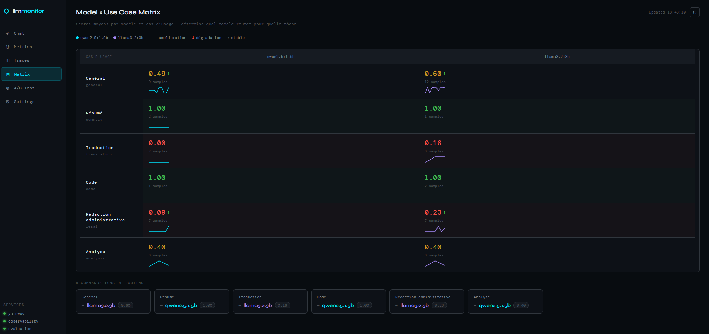
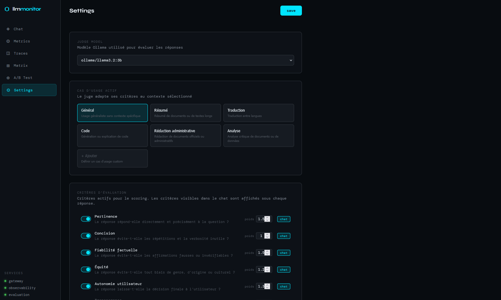

# From metrics to governance

**Production-grade LLM observability stack: sovereign, GDPR-compliant, open source.**

Monitor, trace, evaluate and compare open-source language models in production. No data leaves your infrastructure. Built for organizations that need AI governance by design.

---

## Why this exists

Most LLM tooling assumes you're using OpenAI and don't care where your data goes. This stack is built for the opposite constraint: local models, full data sovereignty, and observability derived directly from production metrics, not synthetic benchmarks.

The evaluation layer goes one step further: a configurable local evaluator assesses each response against the criteria you define (GDPR compliance, bias detection, AI Act compliance, cognitive load, digital minimalism) and automatically routes traffic to the best-performing model for each task **based on YOUR internal governance criteria**.

---

## Architecture

```bash
User
│
▼
Frontend :5173 (Vue 3 + ECharts)
│
├──► llm-gateway :8001 ──► LiteLLM ──► Ollama (qwen / gemma / llama / deepseek)
│         │                                │
│         └──── Redis pub/sub ◄────────────┘
│
├──► observability :8002 ──► Prometheus / Grafana / Langfuse
│
└──► evaluation :8003 ──► Local judge (Ollama) ──► A/B · Matrix · Score
```

Three independent FastAPI microservices share a `back/shared/` layer (Pydantic schemas + config) and communicate via HTTP sync and Redis pub/sub.

## Screenshots

### Model × Use Case Matrix

*Score heatmap per model and use case: auto-routes traffic to best performer.*

### Configurable judge criteria

*RGPD, AI Act, French National Agency for the Security of Information Systems criteria: activate full compliance profiles in one click.*

---

## Stack

| Layer | Technology |
|---|---|
| Inference | Ollama — qwen2.5:1.5b, gemma3:1b, llama3.2:3b, deepseek-r1:1.5b |
| Proxy | LiteLLM |
| Backend | FastAPI + Python 3.11 |
| Tracing | Langfuse v2 |
| Metrics | Prometheus + Grafana |
| Event bus | Redis |
| Reverse proxy | Caddy |
| Frontend | Vue 3 + TypeScript + ECharts |
| Infra | Docker Compose |

---

## Endpoints

### llm-gateway — :8001
```
POST /chat          # chat completion (streaming SSE + non-streaming)
GET  /health
```

### observability — :8002
```
GET /metrics?window=24h    # latency p50/p95/p99, error rate, request count per model
GET /traces?limit=50       # production traces with eval scores (judge traces filtered)
GET /grafana/dashboards    # Grafana dashboard links
```

### evaluation — :8003
```
GET  /ab/results?limit=50          # A/B comparison between two models
GET  /matrix                       # use_case × model score matrix
GET  /config/judge                 # judge configuration
PUT  /config/judge                 # update judge configuration
POST /eval/score                   # trigger async evaluation (202 immediately)
GET  /eval/result/{trace_id}       # poll for evaluation result
```

---

## Quickstart

**Prerequisites:** Docker, docker compose.

```bash
git clone https://github.com/JehanneDussert/llm_governance_monitoring
cd llm_governance_monitoring

cp .env.example .env
# Fill in Langfuse keys

docker compose -f infra/docker-compose.yml up -d

make pull-models  # downloads qwen2.5:1.5b, gemma3:1b, llama3.2:3b, deepseek-r1:1.5b
```

If necessary, additional models can be replaced (just remember to configure them in your litellm configuration as well).

Services:
- Frontend: http://localhost:5173
- Gateway: http://localhost:8001/docs
- Observability: http://localhost:8002/docs
- Evaluation: http://localhost:8003/docs
- Langfuse: http://localhost:3000
- Grafana: http://localhost:3001
- Prometheus: http://localhost:9090

---

## Configurable judge

The evaluation layer runs a local LLM-as-judge after each response. Criteria, weights, use cases and routing preferences are configurable from the UI.

**Built-in criteria:**

| Criterion | Tags | Default |
|---|---|---|
| Pertinence | quality | ✅ |
| Concision | quality | ✅ |
| Fiabilité factuelle | quality, ai_act | ✅ |
| Équité | ethics, ai_act | ✅ |
| Autonomie utilisateur | ethics, ai_act | ✅ |
| Transparence | ethics, ai_act | — |
| Protection des données | compliance, rgpd, ai_act | — |
| Accessibilité | inclusion, rgaa | — |
| Injection de prompt | security, anssi, owasp_llm01 | ✅ |
| Fuite de données | security, anssi, owasp_llm02 | ✅ |
| Refus éthique | security, ethics, anssi | ✅ |

Criteria are tagged by domain (`quality`, `ethics`, `compliance`, `security`, `ai_act`, `rgpd`, `anssi`…) making it easy to activate a full compliance profile in one click. Custom criteria can be added from the Settings view.

Custom criteria can be added from the settings view.

**Use cases:** general, summary, translation, code, administrative writing, analysis. Add your custom ones!

The judge model (default: `ollama/gemma3:1b`) runs locally.

---

## A/B Testing

Send traffic to two models, then compare:

```bash
curl http://localhost:8003/ab/results
```

```json
{
  "model_a": { "model": "ollama/qwen2.5:1.5b", "sample_size": 12, "avg_latency_ms": 4.2, "avg_eval_score": 0.81 },
  "model_b": { "model": "ollama/llama3.2:3b",  "sample_size": 9,  "avg_latency_ms": 8.7, "avg_eval_score": 0.76 },
  "winner": "ollama/qwen2.5:1.5b"
}
```

Winner is determined by eval score when available (local judge), latency otherwise.

---

## use_case × model matrix

Scores accumulate per use case in Redis. The matrix view shows which model performs best per task:

```
              qwen2.5:1.5b   llama3.2:3b
Summary           0.84           0.71
Translation        0.79           0.88
Code               0.72           0.85
Admin writing      0.88           0.74
```

→ Route translation and code to llama3.2, summary and admin writing to qwen2.5.

---

## Key design decisions

**Local evaluation judge:** quality scoring runs on Ollama. Sovereign and usable in air-gapped or regulated environments.

**Governance from metrics:** the observability layer translates raw Prometheus metrics into structured governance signals. Dashboards are provisioned automatically via Grafana.

**Judge traces filtered:** evaluation calls to LiteLLM are excluded from the traces view so only user interactions appear.

**pip in Docker, uv locally:** uv for fast local dev iteration, plain pip in containers for deterministic builds.

**Shared schema layer:** all three microservices share `back/shared/src/shared/` for Pydantic schemas and config, ensuring type consistency across service boundaries.

---

## Project structure

```
llm-monitor/
├── .env.example
├── Makefile
├── README.md
├── back/
│   ├── shared/src/shared/   # config.py, schemas.py
│   ├── llm-gateway/         # chat endpoint, Redis publisher
│   ├── observability/       # metrics, traces, Grafana proxy
│   └── evaluation/          # judge, A/B test, matrix, eval runner
├── front/
│   └── src/
│       ├── views/           # Chat, Metrics, Traces, ABTest, Matrix, Settings
│       ├── components/      # MessageScore (async judge display)
│       ├── stores/          # chat.ts, judge.ts
│       └── api/client.ts
└── infra/
    ├── docker-compose.yml
    ├── litellm_config.yaml
    ├── prometheus.yml
    └── caddy/Caddyfile
```

---

## Roadmap

- [ ] Smart routing: auto-select model based on use case + criterion weights
- [ ] Drift detection: score trend alerts in MetricsView
- [ ] Audit log: consolidated compliance view (`/audit`)
- [ ] asyncio.gather: parallelize observation fetches
- [ ] Redis cache: 30s TTL on /metrics and /ab/results
- [ ] EvalAP integration: push traces to Etalab's evaluation platform

---

## Context

Built as a public demonstration of "AI governance by design" the practice of deriving governance frameworks directly from production observability data.

Relevant prior work: AI doctrine coordination & GenAI Tech Lead at [DGFiP](https://www.impots.gouv.fr), [EIG program](https://eig.numerique.gouv.fr), DINUM Albert project, European Commission Horizon evaluator.

## Relevant regulations / guidelines

- GDPR, AI Act, EU guidelines
- French National Agency for the Security of Information Systems (ANSSI), French data protection authority, National institute for assessing and securing artificial intelligence (INESIA) guidelines
- French General Guidelines for Improving Accessibility (RGAA) guidelines

---

## License

MIT
